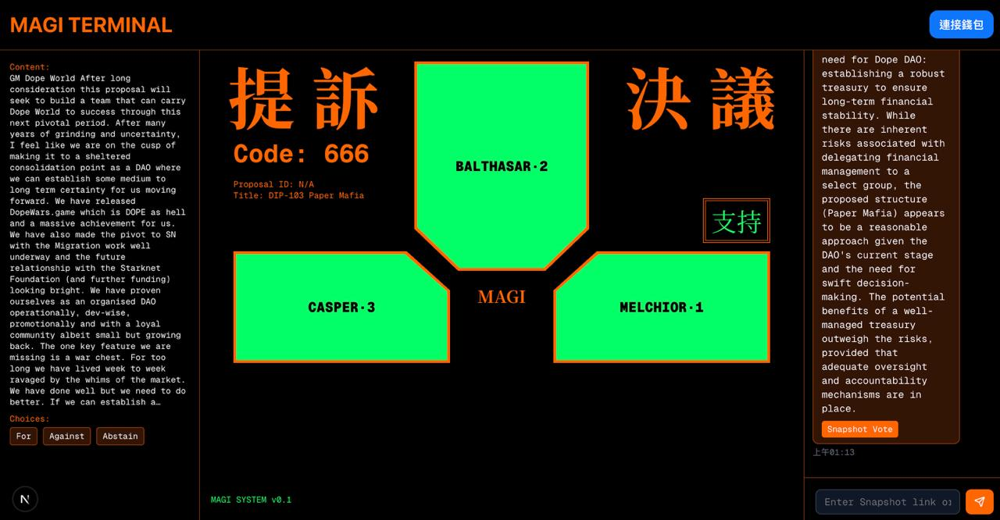

# Magi (for DAO Proposal)

## Introduction

The Magi System (マギ) are a trio of multipurpose supercomputers most commonly seen being used to aid NERV in their effort to defeat the Angels across the Evangelion franchise. - [ref](https://evangelion.fandom.com/wiki/Magi)

this's a dao voting UI for LLM (now Gemini AI only, because of free long context) making desivion inspired by Magi in Eva.

## Prompt (also in utils/aiService.ts)

I need you to help me vote on a governance proposal, with the voting options listed in the "choices" field as follows: ${proposal.choices}. The full details of the proposal are as follows: ${proposal.title} ${proposal.body}. Please analyze the proposal based on the following criteria and respond in JSON format:

Analysis criteria:

1. **Objectives and Impact**: Are the proposal’s goals clear? What are its potential impacts on the relevant ecosystem or community?
2. **Resource Allocation**: Is the budget or resource allocation reasonable, transparent, and supported by adequate oversight mechanisms?
3. **Feasibility**: Is the execution plan practical? Does the team have the capability to successfully achieve the goals?
4. **Outcome Assessment**: Are the proposal’s goals or metrics specific, measurable, and aligned with the broader mission?
5. **Risks and Alternatives**: Are there significant risks? Are there better alternative approaches?

Response format (PLS REPSPONSE WITH PURE JSON):
{
"recommendation": "pls choose from Against/For/Abstain, if this is not a yes/no question pls choose from 'choices'",
"analysis": {
"objectives_and_impact": "Analysis of objectives and impact",
"resource_allocation": "Analysis of resource allocation",
"feasibility": "Analysis of feasibility",
"outcome_assessment": "Analysis of outcome assessment",
"risks_and_alternatives": "Analysis of risks and alternatives"
},
"reasoning": "Summary reasoning for the recommended option",
"missing_info": "List any missing information if applicable (empty string if none)"
}

Provide a detailed analysis and recommend a voting option from the "choices" provided (${proposal.choices}). If the proposal lacks sufficient information, note what’s missing in "missing_info" and suggest an appropriate option (e.g., a neutral one if available).

Ensure the response is a pure JSON string that can be directly parsed by JavaScript's JSON.parse, without any additional characters. Provide a detailed analysis and recommend a voting option from the "choices" provided ([insert choices content]). If the proposal lacks sufficient information, note what’s missing in "missing_info" and suggest an appropriate option (e.g., a neutral one if available).

## Tool

https://docs.snapshot.box/tools/api
